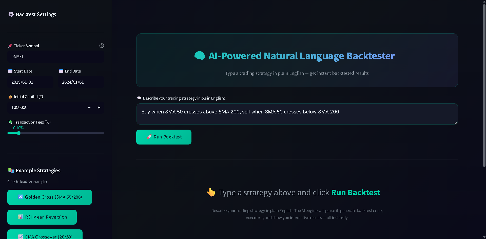
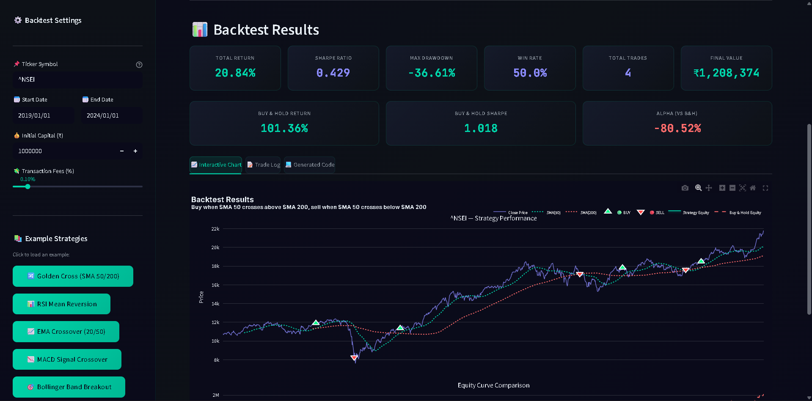

# 🧠 AI-Powered Natural Language Backtester

> Type a trading strategy in plain English — get instant backtested results.


---

## ✨ What Is This?

A **Streamlit web app** that lets you describe trading strategies in **plain English** and instantly runs backtests on historical stock data. No coding required.

**Example input:**
```
Buy when SMA 50 crosses above SMA 200, sell when SMA 50 crosses below SMA 200
```

**What you get:**
- 📊 Key metrics (Total Return, Sharpe Ratio, Max Drawdown, Win Rate, Alpha)
- 📈 Interactive Plotly chart with indicators + buy/sell markers
- 📝 Detailed trade log with entry/exit prices
- 💻 Auto-generated Python backtest code you can copy & learn from

---

## 🖥️ Screenshots

<p align="center">
  
  <br><em>Premium dark UI with strategy input and sidebar settings</em>
</p>

<p align="center">
  
  <br><em>Interactive chart with SMA indicators and buy/sell signals</em>
</p>

---

## 🚀 Quick Start

### 1. Clone the repo
```bash
git clone https://github.com/YOUR_USERNAME/ai-backtester.git
cd ai-backtester
```

### 2. Install dependencies
```bash
pip install -r requirements.txt
```

### 3. Run the app
```bash
python -m streamlit run app.py
```

Then open **http://localhost:8501** in your browser.

---

## 💬 Supported Strategies

Just type naturally — here are some examples:

| Strategy | Input |
|----------|-------|
| **Golden Cross** | `Buy when SMA 50 crosses above SMA 200, sell when SMA 50 crosses below SMA 200` |
| **RSI Mean Reversion** | `Buy when RSI drops below 30, sell when RSI goes above 70` |
| **EMA Crossover** | `Buy when EMA 20 crosses above EMA 50, sell when EMA 20 crosses below EMA 50` |
| **MACD Signal** | `Buy when MACD line crosses above MACD signal, sell when MACD crosses below signal` |
| **Bollinger Breakout** | `Buy when price crosses above upper Bollinger Band, sell when price drops below lower band` |
| **Custom** | `Buy when SMA 10 crosses above SMA 30, sell when SMA 10 crosses below SMA 30` |

### Supported Indicators
- **SMA** (Simple Moving Average) — any period
- **EMA** (Exponential Moving Average) — any period
- **RSI** (Relative Strength Index) — default 14-period
- **MACD** (Line, Signal, Histogram) — default 12/26/9
- **Bollinger Bands** (Upper, Lower, Middle) — default 20-period, 2σ
- **Price** (close/closing price)

### Supported Conditions
`crosses above` · `crosses below` · `is above` · `is below` · `breaks above` · `drops below` · `goes above` · `falls below`

---

## 🏗️ Architecture

```
User Input                     "Buy when SMA 50 crosses above SMA 200"
    │
    ▼
┌──────────────┐
│  parser.py   │               NL → ParsedStrategy object
│  Rule-based  │               {indicators, conditions, actions}
│  NLP engine  │
└──────┬───────┘
       │
       ▼
┌──────────────────┐
│ code_generator.py│           ParsedStrategy → Python/vectorbt code
│  Template engine │
└──────┬───────────┘
       │
       ▼
┌──────────────┐
│ backtester.py│               exec() in sandboxed namespace
│  Execution   │               Returns metrics + chart data
└──────┬───────┘
       │
       ▼
┌──────────────┐
│   app.py     │               Streamlit dashboard
│  Dashboard   │               Metric cards + Plotly charts + Trade log
└──────────────┘
```

### File Structure
```
ai-backtester/
├── app.py                  # Main Streamlit app (entry point)
├── parser.py               # NL strategy parser (rule-based NLP)
├── code_generator.py       # Generates vectorbt Python code
├── backtester.py           # Executes generated code safely
├── requirements.txt        # Python dependencies
├── .gitignore
├── .streamlit/
│   └── config.toml         # Streamlit theme configuration
├── assets/                 # Screenshots for README
│   ├── home.png
│   └── results.png
├── LICENSE
└── README.md
```

---

## ⚙️ Configuration

### Sidebar Settings (in the app)
| Setting | Default | Description |
|---------|---------|-------------|
| **Ticker** | `^NSEI` | Any Yahoo Finance ticker (RELIANCE.NS, AAPL, SPY, etc.) |
| **Start Date** | 2019-01-01 | Backtest start date |
| **End Date** | 2024-01-01 | Backtest end date |
| **Initial Capital** | ₹10,00,000 | Starting portfolio value |
| **Transaction Fees** | 0.10% | Per-trade cost (brokerage + STT) |

---

## 🛠️ Tech Stack

| Component | Technology |
|-----------|-----------|
| **Frontend** | Streamlit + Custom CSS |
| **Charts** | Plotly (interactive, dark theme) |
| **Backtesting** | vectorbt |
| **Data** | yfinance (Yahoo Finance API) |
| **NLP Parser** | Custom rule-based (regex + tokenizer) |
| **Language** | Python 3.10+ |

---

## 📈 Portfolio Context

This project was built as part of a **quantitative finance portfolio** that includes:

1. **Dual Moving Average Crossover** — SMA 50/200 golden cross strategy
2. **RSI Mean Reversion** — RSI(14) oversold/overbought signals
3. **Pairs Trading** — HDFCBANK.NS vs ICICIBANK.NS statistical arbitrage
4. **AI NL Backtester** (this project) — Natural language strategy engine

---

## 🤝 Contributing

Contributions are welcome! Here's how:

1. Fork the repository
2. Create a feature branch (`git checkout -b feature/new-indicator`)
3. Commit your changes (`git commit -m 'Add Stochastic Oscillator support'`)
4. Push to the branch (`git push origin feature/new-indicator`)
5. Open a Pull Request

### Ideas for Contribution
- [ ] Add more indicators (Stochastic, ADX, ATR, VWAP)
- [ ] Add stop-loss / take-profit parsing
- [ ] LLM integration (OpenAI/Gemini) for complex strategy parsing
- [ ] Multi-asset portfolio backtesting
- [ ] Strategy comparison mode
- [ ] Deploy to Streamlit Cloud

---

## 📄 License

This project is licensed under the MIT License — see the [LICENSE](LICENSE) file.

---

<p align="center">
  Built with ❤️ by <b>Vismay</b> · 2024
  <br>
  <sub>Powered by Python · Streamlit · vectorbt · Plotly</sub>
</p>
